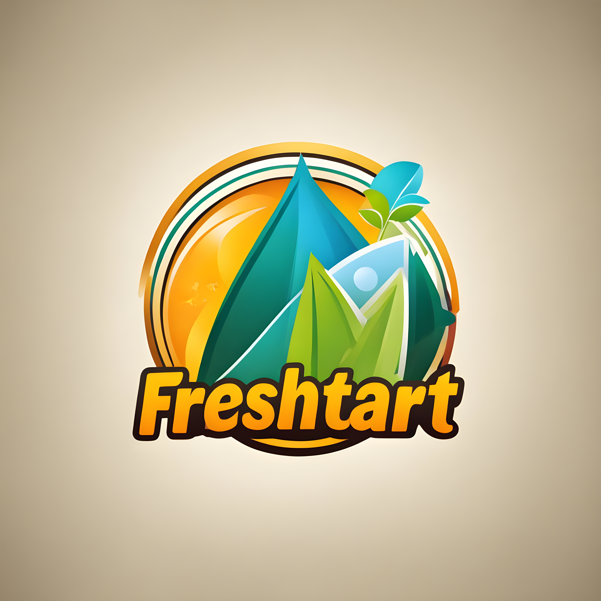

<div align="center">


</div>

<!-- PROJECT LOGO -->
<br />
<div align="center">
  <a href="https://github.com/abhijithanandan">
    
  </a>
  <h3 align="center">FreshStart Social Media App</h3>
  <div align="center">
    A Social Media App for University Students  
    <br />
    <a href="https://github.com/abhijithanandan/FS-SM-MERN/docs/README.md"><strong>Explore the docs »</strong></a>
    <br />
    <br />
    <a href="https://github.com/abhijithanandan/FS-SM-MERN/demo/README.md">View Demo</a>
    ·
    <a href="https://github.com/abhijithanandan/FS-SM-MERN/issues">Report Bug</a>
    ·
    <a href="https://github.com/abhijithanandan/FS-SM-MERN/issues">Request Feature</a>
  </div>
</div>

<!-- TABLE OF CONTENTS -->
<details open>
  <summary>Table of Contents</summary>
  <ol>
    <li>
      <a href="#about-the-project">About The Project</a>
      <ul>
        <li><a href="#built-with">Built With</a></li>
      </ul>
    </li>
    <li>
      <a href="#getting-started">Getting Started</a>
      <ul>
        <li><a href="#prerequisites">Prerequisites</a></li>
        <li><a href="#installation">Installation</a></li>
      </ul>
    </li>
    <li><a href="#usage">Usage</a></li>
    <li><a href="#contributing">Contributing</a></li>
    <li><a href="#license">License</a></li>
    <li><a href="#contact">Contact</a></li>
    <li><a href="#acknowledgments">Acknowledgments</a></li>
  </ol>
</details>

<!-- ABOUT THE PROJECT -->
## About The Project

<div align="center">
  
  
 
  <!-- Add vertical space -->
  <br>  
  <br>  
  <br>  

</div>

* This is a Social Media Application for University Students and Alumni with exclusivity and some cool features
* The app is built on a robust scalable clean backend architechture
* The app is designed to be modular keeping in mind low latency, high throughput deployment

## Major Features Include:

- 🛡️ **Secure Authentication**: Secure sign-in features to ensure the privacy and security of student and alumni profiles.
- 👤 **Profile Customization**: Users can create and personalize profiles with details such as major, graduation year, and current occupation or study.
- 🤝 **Networking**: A platform for students and alumni to connect, collaborate, and build professional and academic networks.
- 📅 **Event Information**: Stay updated with university events, alumni meetups, seminars, and workshops.
- 🏛️ **Groups and Communities**: Join or create groups and communities based on interests, departments, or activities.
- 📋 **Job Board**: Access a job board to explore internship, part-time, and full-time job opportunities, as well as mentorship programs.
- 💬 **Messaging**: Direct messaging feature for private communication between users.
- 📰 **News Feed**: A real-time news feed to share and view updates, posts, and announcements from the university and fellow users.
- 🎓 **Alumni Directory**: Searchable directory to easily find and connect with alumni across various batches and courses.
- 📘 **Integration with Academic Resources**: Seamless integration with university academic resources and platforms.
- 🔒 **Privacy Controls**: Full control over privacy settings, allowing users to manage who can view their profiles and interact with them.
- 📢 **University Updates**: Get timely updates and announcements from the university administration and departments.

<p align="right">(<a href="#readme-top">back to top</a>)</p>

### Built With

<!-- Using Devicon font -->
<!--  -->  
<!-- * [![Flutter][Flutter-Icon]][https://flutter.dev] -->

<!-- Using skill-icons -->
<div align="center">
  <a href="https://skillicons.dev">
    
  </a>
</div>

<p align="right">(<a href="#readme-top">back to top</a>)</p>

<!-- Using Shields.io and Simple Icons -->
<!--    -->


<!-- GETTING STARTED -->
## 🚀 Getting Started

The App can be used on any web browser accessible on Android, iOS, or computer. Follow the instructions below to get the project up and running on your local machine for development and testing purposes.

### Prerequisites

Here’s how to get started:

  * Ensure you have Node.js installed on your system.
  * If not, follow the [Node.js installation guide](https://nodejs.org/en/download/package-manager).
  * Ensure you have MongoDB installed on your system.
  * If not, follow the [MongoDB installation guide](https://docs.mongodb.com/manual/installation).
  * Confirm Git is set up on your system.
  * If not, follow the [Git setup guide](https://git-scm.com/book/en/v2/Getting-Started-Installing-Git).

### Installation
1. Clone this repository using the command:
    ```sh
     git clone https://github.com/yourusername/yourprojectname.git
    ```
2. Navigate to the project directory:
    ```sh
      cd yourprojectname
    ```  
3. Install Required Dependencies:
    ```sh
      npm install
    ```
4. Environment Variables:
    Set up the necessary environment variables in a .env file in your project root.
    ```env
      DATABASE_URL=mongodb+srv://yourdatabaseurl
      SECRET=yourjsonwebtokenkey
    ```
5. Run the Application:
   - Start the server by running:
    ```sh
      npm start
    ```
6. Now, the app should be running locally on http://localhost:yourport. Adjust the commands and URLs to fit your project details.


<p align="right">(<a href="#readme-top">back to top</a>)</p>


<!-- USAGE EXAMPLES -->
## Usage

### Demo Coming Soon!

<p align="right">(<a href="#readme-top">back to top</a>)</p>

<!-- CONTRIBUTING -->
## Contributing

Contributions are what make the open source community such an amazing place to learn, inspire, and create. Any contributions you make are **greatly appreciated**.

If you have a suggestion that would make this better, please fork the repo and create a pull request. You can also simply open an issue with the tag "enhancement".
Don't forget to give the project a star! Thanks again!

1. Fork the Project
2. Create your Feature Branch (`git checkout -b feature/AmazingFeature`)
3. Commit your Changes (`git commit -m 'Add some AmazingFeature'`)
4. Push to the Branch (`git push origin feature/AmazingFeature`)
5. Open a Pull Request

<p align="right">(<a href="#readme-top">back to top</a>)</p>


<!-- LICENSE -->
## License

Distributed under the GNU License. See `LICENSE.txt` for more information.

<p align="right">(<a href="#readme-top">back to top</a>)</p>


<!-- CONTACT -->
## Contact

Abhijith Anandakrishnan - [@abhijithanandan](https://twitter.com/abhijithanandan) - info@abhijithanandan.com 

Project Link: [https://github.com/abhijithanandan/FS-SM-MERN](https://github.com/abhijithanandan/FS-SM-MERN)

<p align="right">(<a href="#readme-top">back to top</a>)</p>

## Branch Ownership

 | Status | Branch | Owner
 | --- | --- | ---
 |  | `development` | [Abhijith Anandakrishnan](abhijithananthan@gmail.com)


<!-- ACKNOWLEDGMENTS -->
## Acknowledgments

* Tornotron E Commerce Private Ltd. - [https://tornotron.com](https://tornotron.com)

<p align="right">(<a href="#readme-top">back to top</a>)</p>

